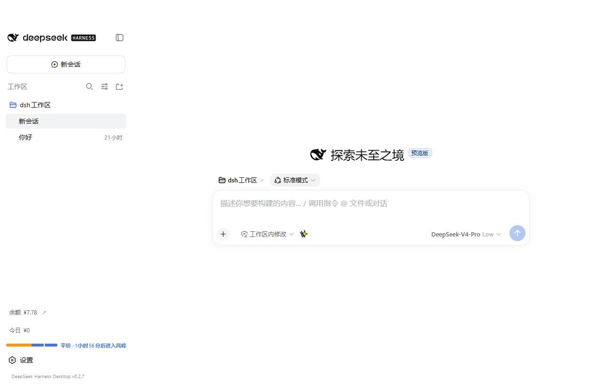
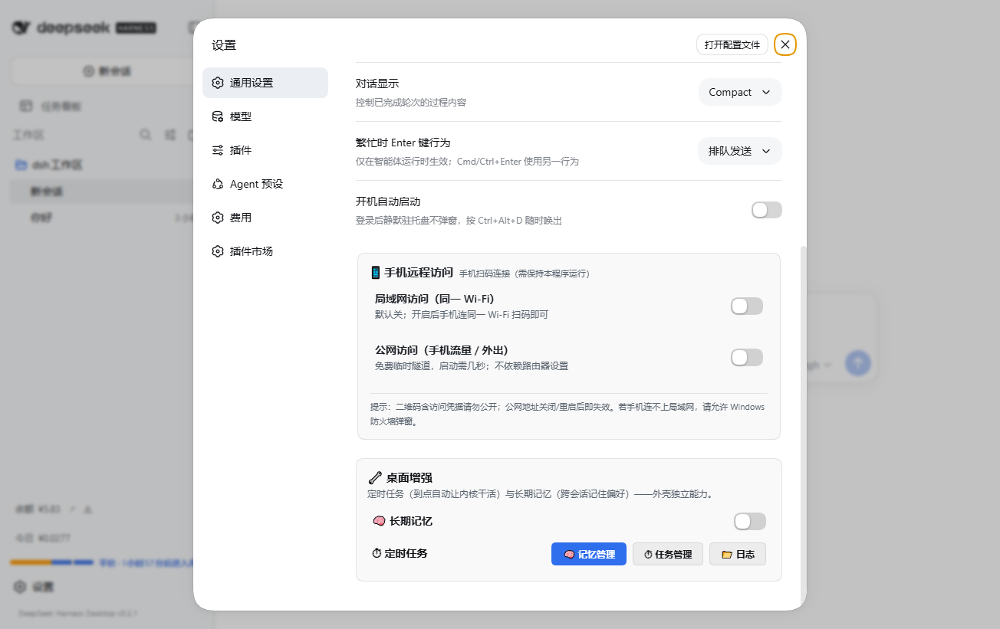
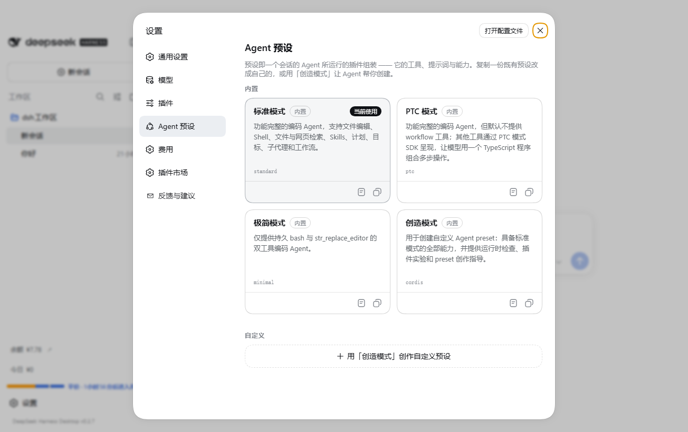
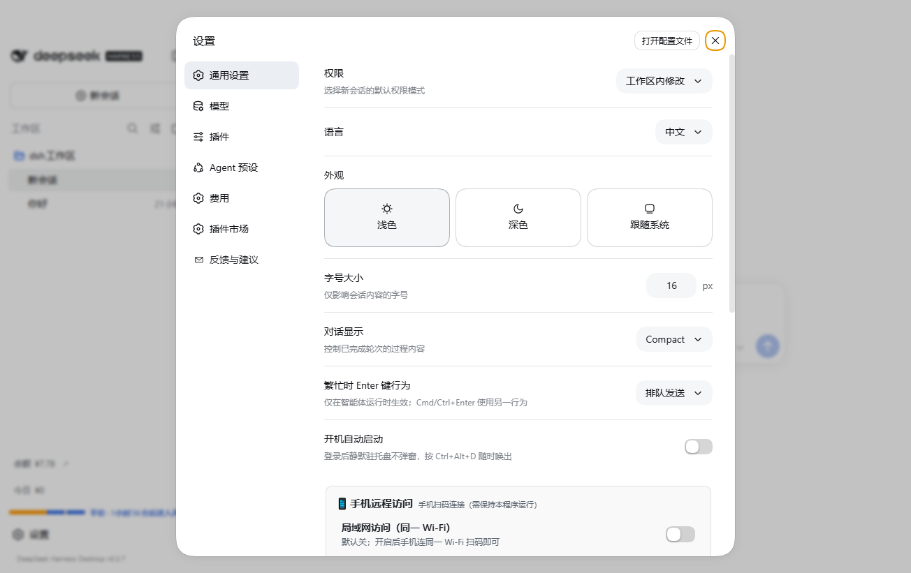
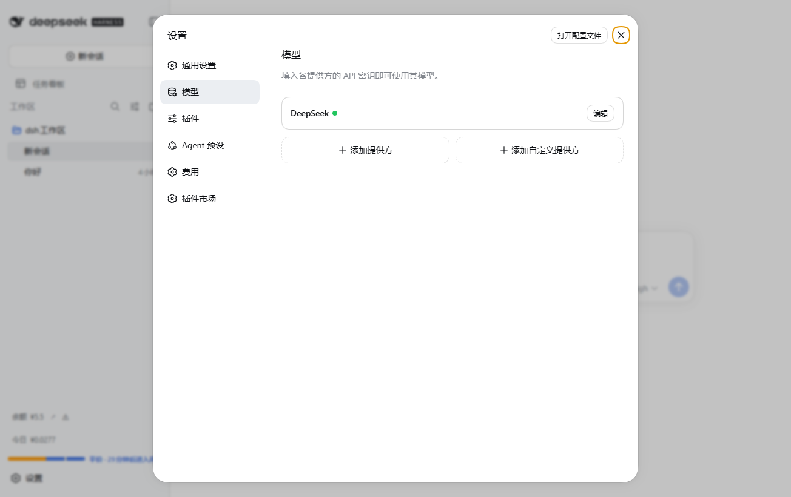

<!-- dsh-desktop-releases home README (English, 0.2.6) -->
# DeepSeek Harness Desktop

English | [简体中文](README.md)

> ⚠️ **Unofficial project**: a community Windows desktop shell for the open-source [DeepSeek Harness](https://github.com/deepseek-ai/deepseek-harness) (dsh — an AI Agent runtime). Not affiliated with DeepSeek.

Turn **AI Agent** into a desktop app: no Node.js, no CLI. Bundled official kernel + runtime, **double-click to run**.

**Agent-first, out of the box:**
- 🧠 Powered by the official **DeepSeek Harness Agent runtime**: tool calling / plugin ecosystem / long context
- 🤖 One kernel, many Agent use cases: chat, scheduled tasks, automation, long-term memory
- 🧩 Extensible via plugin market (e.g. **multi-agent team collaboration**, auto-installed once upstream adapts)

## ✨ Features

**Basics**
- 🚀 Double-click to run; auto cleanup (no lingering processes); Chinese error fallback with logs + retry
- 🧩 Pre-installed: task-board plugin + plugin market

**Built-in enhancements (0.2.x)**
- 📊 **Usage & cost card**: today / this-month spend, tokens, call counts and official balance at a glance in Settings → General, plus a 7-day spend trend chart and top models (read-only aggregation; graceful fallback if the ledger is missing)
- ✨ **Prompt optimizer**: ✨ button by the chat input — rewrite your whole message or a **selected part** via DeepSeek to be clearer for the AI; a compare dialog shows original vs optimized with one-click **replace / copy** (verified insert, clipboard fallback)
- 📅 **Scheduled tasks**: daily / weekly / interval Agent runs; skips sleep, catches up later; **Windows notification** on completion / failure (click to focus window); expand a task to see its **latest result**
- 🧠 **Long-term memory** on the shell side, fed to scheduled runs; **list / delete** individual memories, or **one-click refine** (paste chat / notes → auto-extract preferences worth remembering, dedup against existing)
- 📱 **Remote access from phone**: scan QR on same Wi-Fi, or a free public tunnel when away (token-protected; auto-closes when idle)
- 🛡️ **3-layer plugin defense**: sentry → auto-isolate & restart → compat matrix
- 🔄 **Auto-update** with one-click restart install
- 💾 **Data safety**: crash self-heal / data-dir lock / backups / health check / remembered port
- 🖥️ **Tray + hotkeys**: `Ctrl+Alt+D` toggle window, `Ctrl+Alt+R` restart service

## 🖼️ Screenshots

| Main | General settings & enhancement cards | Agent presets | Personalization |
|---|---|---|---|
|  |  |  |  |

## 📥 Download

Grab the latest from **Releases** on the right:

| File | Description |
|---|---|
| `DeepSeek-Harness-Desktop-Setup-<version>.exe` | **Installer (recommended)**, supports auto-update |
| `DeepSeek-Harness-Desktop-<version>-portable.exe` | Portable, no install needed |

> ⚠️ Binaries are **unsigned**: SmartScreen may show "Unknown publisher" — confirm this repo, then "More info → Run anyway".

## 🚀 First run

1. Double-click and wait for the window (3–10 s; first run initializes plugins)
2. In **Settings → Models**, fill in your provider API key (DeepSeek official or OpenAI-compatible)
3. Start chatting / using Agents. Enable **remote access**, **scheduled tasks / memory** under Settings → General

## 🕹️ Quick guide

| Where | What |
|---|---|
| Tray (right-click) | open window / restart / autostart / backup / health check / check update / feedback / about / restore isolated plugins |
| Hotkeys | `Ctrl+Alt+D` toggle window · `Ctrl+Alt+R` restart |
| Settings → General | autostart, data tools, phone remote (LAN / public), desktop enhancements (memory switch + scheduler) |

## 🔄 Updates

- **Auto**: silent check 20 s after launch; prompts when a new version is found
- **Manual**: Tray → "Check for updates…", or reinstall over the old version (data kept)

## 🔐 Data & privacy

- Data lives in `~/.dsh`: sessions / config / plugins / memory / schedules
- API keys in `~/.dsh\.credentials.yaml` — **never upload this folder to cloud drives or share it**
- Uninstall does **not** delete `~/.dsh`
- The built-in backup warns that backups contain plaintext keys — keep them encrypted

## ❓ FAQ

**Getting started**
| Q | A |
|---|---|
| Is it paid? | App is free; bring your **own model API key** (DeepSeek or OpenAI-compatible) |
| Does it need a GPU? | No — inference runs on cloud model APIs |
| Relation to DeepSeek? | None. Official kernel is open source; this repo is a community shell + release channel |

**Usage**
| Q | A |
|---|---|
| "Unknown publisher" on first run | Normal (unsigned); run anyway after verifying the source |
| Will I lose chats? | No — data is in `~/.dsh`, kept across upgrades |
| Phone can't reach LAN page | Allow Windows Firewall prompt; phone on the same Wi-Fi |
| How to check updates | Tray → "Check for updates…" (or auto-check 20 s after launch) |

**Plugins**
| Q | A |
|---|---|
| Broken start after installing a plugin/theme | dsh fails hard if one plugin entry fails; the 3-layer defense auto-isolates & notifies. Still stuck? See Tray → "Isolated plugins", or remove manually |
| Why no agent-teams plugin? | Upstream hasn't adapted to the pinned kernel yet; auto-installs once compatible |

## 💬 Feedback

Bugs & suggestions → **Issues** (in-app "Feedback" pre-fills version info).

## 📄 Notes

- This repo is a **release channel only** — no source code
- Whale icon is DeepSeek branding, shown for non-commercial illustration only
